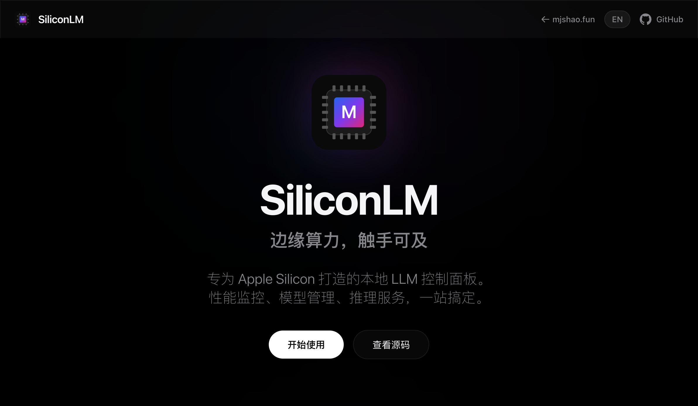

> Local LLM dashboard for Apple Silicon Macs. Manage models, services, embeddings, and downloads.

[Project Website](https://mjshao.fun/siliconlm/) | [GitHub Repository](https://github.com/nxxxsooo/siliconlm)

## Features

- **Machine Info** - Chip, GPU cores, Neural Engine, RAM, disk at a glance
- **MLX Embeddings Server** - OpenAI-compatible `/v1/embeddings` API on port 8766
- **Multi-Backend Support** - MLX, mlx-lm (decoder models), sentence-transformers
- **Service Management** - Start/stop LMStudio, MLX Embeddings, OpenCode
- **Smart Proxy** - Routes `/v1/embeddings` to MLX, `/v1/chat` to LMStudio
- **Model Downloads** - HuggingFace search + aria2 acceleration for large files
- **Settings Panel** - Configure models directory, default embedding model

## Architecture

```
CherryStudio / Client
        │
        ▼
http://localhost:8765/v1/*  (SiliconLM Proxy)
        │
   ┌────┴────┐
   ▼         ▼
/v1/embeddings   /v1/chat/*
   │              │
   ▼              ▼
:8766 (MLX)    :1234 (LMStudio)
   │
   ├─► MLX (bert, roberta)
   ├─► mlx-lm (Qwen3, gte-Qwen2)
   └─► sentence-transformers (bge-m3)
```

## Supported Embedding Models

| Model | Backend | Dimensions | Speed |
|-------|---------|------------|-------|
| mixedbread-ai/mxbai-embed-large-v1 | MLX | 1024 | Fast |
| BAAI/bge-m3 | sentence-transformers | 1024 | Medium |
| mlx-community/Qwen3-Embedding-0.6B-4bit | mlx-lm | 1024 | Fast |
| mlx-community/Qwen3-Embedding-8B-4bit | mlx-lm | 4096 | Medium |
| mlx-community/gte-Qwen2-7B-instruct-4bit | mlx-lm | 3584 | Medium |

## Tech Stack

| Component | Technology |
|-----------|------------|
| Backend | FastAPI + uvicorn |
| Frontend | TailwindCSS + Vanilla JS |
| Embeddings | MLX + mlx-lm + sentence-transformers |
| Downloads | huggingface_hub + aria2 |
| Proxy | httpx async |

## License

MIT
